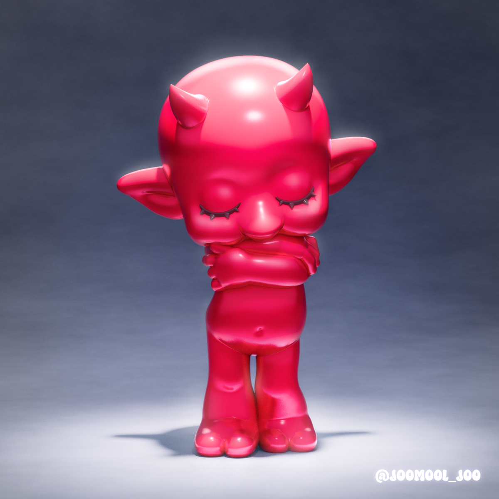

<!DOCTYPE html>
<html lang="ko">
<head>
    <meta charset="UTF-8">
    <meta name="viewport" content="width=device-width, initial-scale=1.0">
    <title>아트토이 작가 포트폴리오</title>
    <link rel="stylesheet" as="style" crossorigin href="https://cdn.jsdelivr.net/gh/orioncactus/pretendard@v1.3.9/dist/web/static/pretendard.css" />
    
</head>
<body>

    <header>
        
ARTIST NAME

        <nav>
            <a href="#portfolio">포트폴리오</a>
            <a href="#shop">판매 작품</a>
            <a href="#about">소개</a>
        </nav>
    </header>

    <section class="hero">
        <h1>Welcome to My Universe</h1>
        
작고 단단한 세계를 만드는 아트토이 작가 OOO입니다.

    </section>

    

        <h2 class="section-title">최신 작품 및 판매</h2>
        

            

                 

                    <h3>The Dreamer</h3>
                    
레진, 아크릴 채색 | 2024

                    <a href="#" class="btn-buy">작품 상세 보기</a>
                

            

            
            

                 

                    <h3>Midnight Cat</h3>
                    
바이닐, 혼합 매체 | 2024

                    <a href="#" class="btn-buy">작품 상세 보기</a>
                

            

            

                 

                    <h3>한정판 No.1</h3>
                    
₩ 150,000 (구매 가능)

                    <a href="작가님 인스타 혹은 오픈채팅 주소" class="btn-buy" style="background-color: var(--point-color); color: #000;">구매 문의하기</a>
                

            

        

    

    <footer>
        <a href="https://instagram.com/joomool_joo" class="insta-link">@joomool_joo</a>
        &copy; 2024 Artist Name. All rights reserved.  
        모든 작품의 저작권은 작가에게 있습니다.
    </footer>

</body>
</html>
